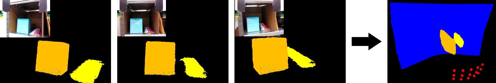
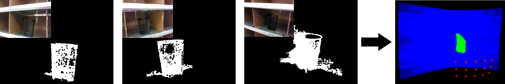

# label-fusion: Volumetric Fusion of Multiple Semantic Labels



C++ code to fuse multiple object mask images into OctoMap, which can be then used for 3d reconstruction of objects.


## Requirements

- [OpenCV](http://opencv.org) (tested with OpenCV 2.4.8)
- [Eigen](http://eigen.tuxfamily.org)
- [octomap (modified version)](https://github.com/wkentaro/octomap/tree/label_fusion) (automatically resolved by `build.sh`)
- [PCL](http://pointclouds.org) (tested with PCL 1.7.1)


## Installation

```bash
git clone https://github.com/wkentaro/label-fusion.git
cd label-fusion
./build.sh
```


## Demo


### Fusion of multiple labels

```bash
./demo.py label_view  # see inputs
./demo.py label_fusion
```


### Fusion of multiple masks

We also support fusing multiple masks:



```bash
./demo.py mask_view  # see inputs
./demo.py mask_fusion
```


## License

MIT License (see `LICENSE` file).
